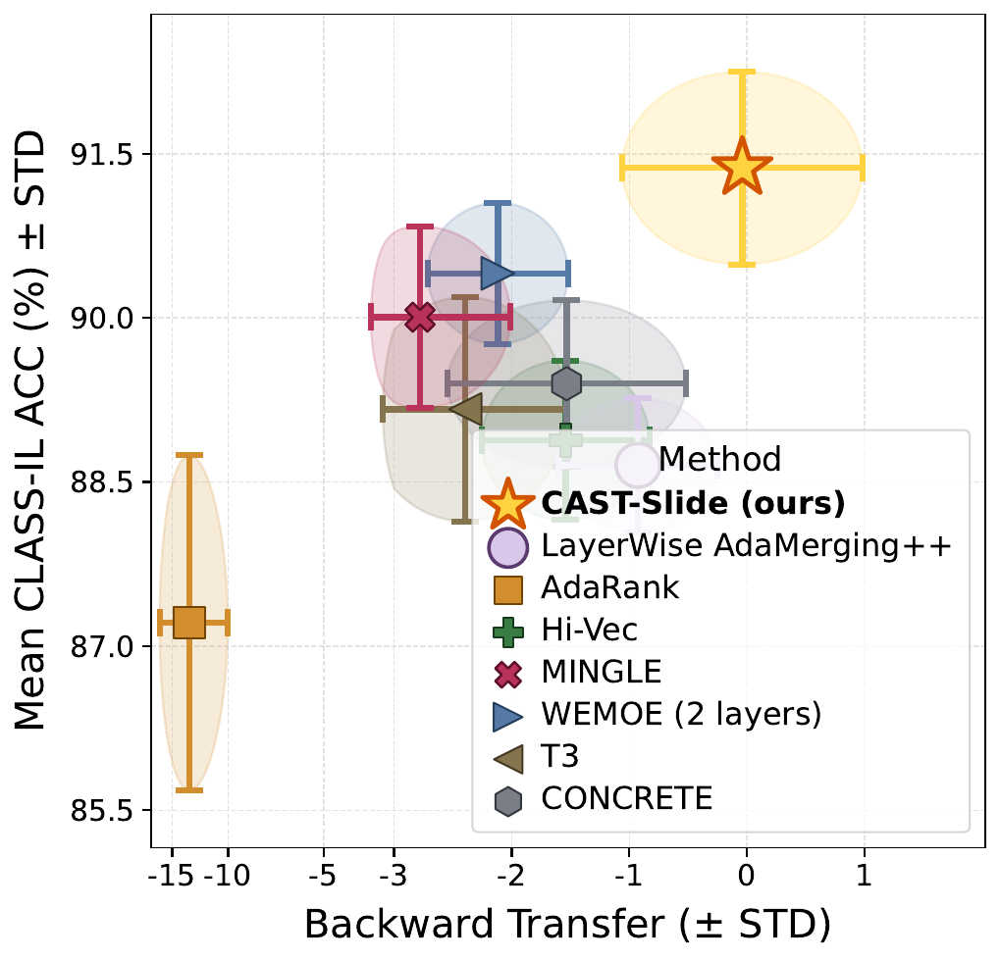
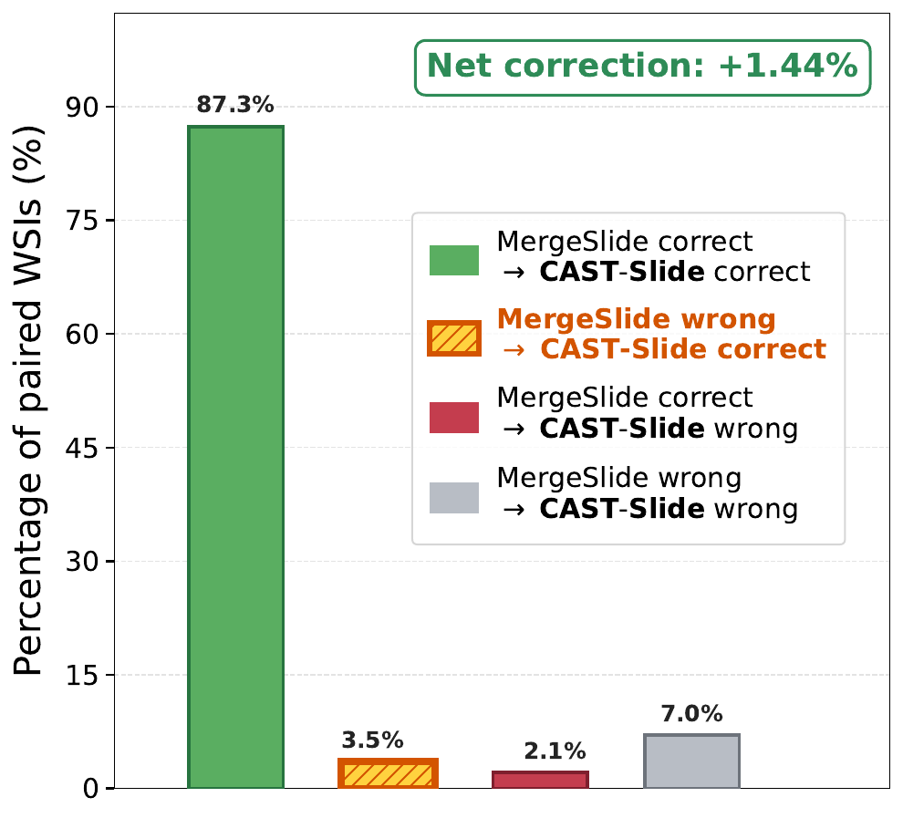
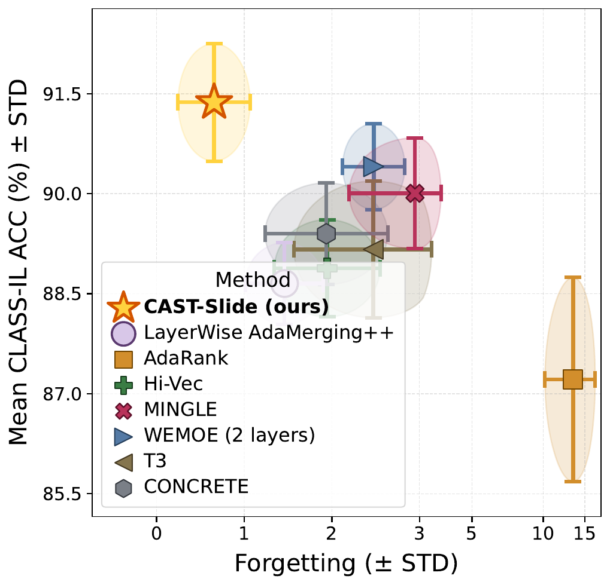
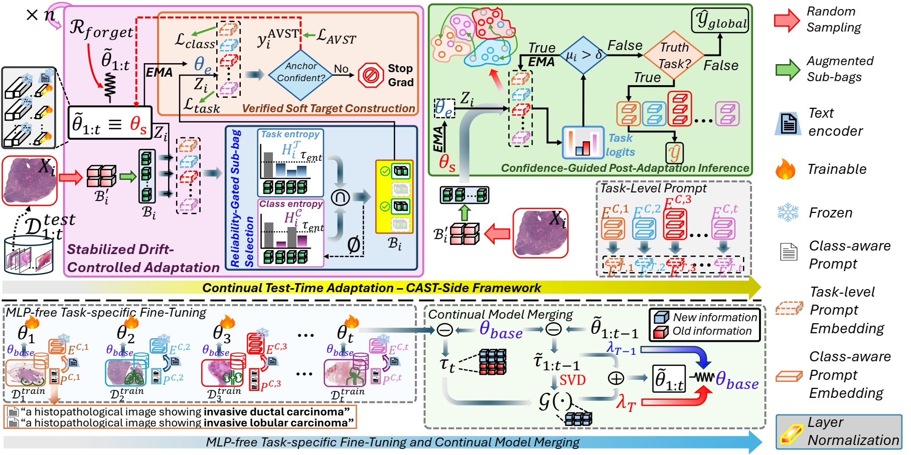
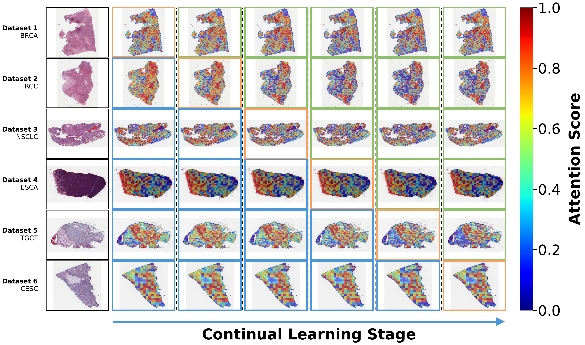

# CAST-Slide: Continual Model Merging with Confidence-Aligned Soft-Target Adaptation on Whole-Slide Images Analysis

CAST-Slide is a test-time adaptation framework for continual whole-slide image classification. It adapts a continually merged TITAN slide encoder without source data while controlling noisy sub-bags, pseudo-target errors, representation drift, and uncertain task routing.

## Highlights

CAST-Slide improves the balance between classification performance and continual-learning stability while correcting uncertain task-level prompt routing under distribution shift. The following OOD results summarize its gains in backward transfer, TCP routing, and forgetting behavior.

<table>
  <tr>
    <td width="33.33%" align="center">
      <a href="images/cast_slide_accuracy_bwt_tradeoff_ood.pdf">
        
      </a>
    </td>
    <td width="33.33%" align="center">
      <a href="images/cast_slide_tcp_routing_outcome_ood.pdf">
        
      </a>
    </td>
    <td width="33.33%" align="center">
      <a href="images/cast_slide_accuracy_fgt_tradeoff_ood.pdf">
        
      </a>
    </td>
  </tr>
  <tr>
    <td align="center"><strong>Accuracy vs. backward transfer</strong></td>
    <td align="center"><strong>Task-routing correction</strong></td>
    <td align="center"><strong>Accuracy vs. forgetting</strong></td>
  </tr>
</table>

Click any panel to open its publication-quality PDF.

## Framework

CAST-Slide combines reliability-gated sub-bag selection, anchor-verified soft targets, drift-controlled adaptation, and confidence-gated task-to-class prompt inference in a unified test-time pipeline.

<p align="center">
  <a href="images/CAST-Slide.png">
    
  </a>
</p>

<p align="center">
  <a href="images/CAST-Slide.pptx"><strong>Download the editable framework diagram (PPTX)</strong></a>
</p>

## Attention Consistency

The attention visualization below illustrates how CAST-Slide preserves spatially coherent diagnostic evidence across the continual stream. The high-resolution source is available by clicking the figure.

<p align="center">
  <a href="images/heatmap.pdf">
    
  </a>
</p>

## Environment Setup

The code is developed for Linux, Python 3.10, and CUDA-enabled PyTorch. All experiments were conducted on a single NVIDIA A100-SXM4 GPU with 80 GB of memory.

```bash
conda create -n cast-slide python=3.10 -y
conda activate cast-slide
pip install torch torchvision torchaudio --index-url https://download.pytorch.org/whl/cu121
pip install -r requirements.txt
```

CAST-Slide loads TITAN from Hugging Face at `MahmoodLab/TITAN`. The runtime requires access to the model repository and permission to execute its remote model code.

## Data Preparation

Each WSI is represented by a patch-feature bag and its spatial coordinates:

```text
features: [N, 768]
coords:   [N, 2]
```

Dataset annotations, split files, and feature roots are configured in the YAML files under `configs/`. The PT-first wrapper `tools/run_classil_with_pt_features.py` uses matching `.pt` tensors when available and falls back to HDF5 features when required.

## Main Components

CAST-Slide contains four modules:

1. **Reliability-Gated Sub-Bag Selection** selects gradient-eligible sub-bags using the intersection of class-level and task-level confidence.
2. **Anchor-Verified Soft Target** constructs a detached soft target by cross-checking a frozen source anchor with an EMA teacher.
3. **Stabilized Drift-Controlled Adaptation** updates selected LayerNorm parameters with class, soft-target, task, margin, and source-anchor objectives, then updates the teacher and task prompts by EMA.
4. **Confidence-Gated TCP Inference** routes a slide through the task-specific head when task confidence is sufficient and otherwise uses the global fallback head.

The implementation is organized as follows:

```text
cast_slide/                         Core models, datasets, losses, and TTA engine
train.py                            Per-task WSI finetuning
merge.py                            Continual model merging
test_classIL_tta.py                 CLASS-IL CAST-Slide evaluation
test_classIL_tta_prefix_other_metrics.py
                                    CLASS-IL continual metrics
test_taskIL_tta.py                  TASK-IL CAST-Slide evaluation
scripts/finetune.sh                 Finetuning launcher
scripts/mergemodel.sh               Model-merging launcher
scripts/test_classIL_tta.sh         CLASS-IL launcher
scripts/test_classIL_tta_prefix_other_metrics.sh
                                    Continual-metrics launcher
scripts/test_taskIL_tta.sh          TASK-IL launcher
configs/ind/tta_ind.env             IND adaptation parameters
configs/ood/tta_ood.env             OOD adaptation parameters
task_prompts.pt                     Source task-level prompt embeddings
```

## Checkpoint Layout

```text
checkpoints/
  finetuned/
  merged/
  finetuned_reverse/
  merged_reverse/

checkpoints_ood/
  finetuned/
  merged/
```

The launchers store hot-write outputs under `MERGESLIDE_LOCAL_ROOT`, which defaults to `/docker/data/$USER/MergeSlide_TTA`, and expose them through repo-local symlinks.

## Running CAST-Slide

Run all commands from the repository root. Use `CUDA_VISIBLE_DEVICES` to select a GPU and set a distinct `LOG_DIR` for each experiment.

### 1. Per-Task Finetuning

IND forward:

```bash
CUDA_VISIBLE_DEVICES=0 \
CONFIG=configs/default_eval_num_workers0.yaml \
SAVE_DIR=./checkpoints/finetuned \
LOG_DIR=logs/finetune/ind \
bash scripts/finetune.sh
```

OOD:

```bash
CUDA_VISIBLE_DEVICES=0 \
CONFIG=configs/default_ood_eval_num_workers0.yaml \
SAVE_DIR=./checkpoints_ood/finetuned \
LOG_DIR=logs/finetune/ood \
bash scripts/finetune.sh
```

### 2. Continual Model Merging

IND forward:

```bash
CUDA_VISIBLE_DEVICES=0 \
CONFIG=configs/default_eval_num_workers0.yaml \
FINETUNED_DIR=./checkpoints/finetuned \
MERGED_DIR=./checkpoints/merged \
LOG_DIR=logs/merge/ind \
bash scripts/mergemodel.sh
```

OOD:

```bash
CUDA_VISIBLE_DEVICES=0 \
CONFIG=configs/default_ood_eval_num_workers0.yaml \
FINETUNED_DIR=./checkpoints_ood/finetuned \
MERGED_DIR=./checkpoints_ood/merged \
LOG_DIR=logs/merge/ood \
bash scripts/mergemodel.sh
```

### 3. CLASS-IL Evaluation

TCP routing on IND forward:

```bash
CUDA_VISIBLE_DEVICES=0 \
SETTING=ind ORDER=forward MODE=tcp \
LOG_DIR=logs/cast_slide/ind/classil_tcp \
bash scripts/test_classIL_tta.sh
```

Naive global classification on IND forward:

```bash
CUDA_VISIBLE_DEVICES=0 \
SETTING=ind ORDER=forward MODE=naive \
LOG_DIR=logs/cast_slide/ind/classil_naive \
bash scripts/test_classIL_tta.sh
```

IND reverse and OOD use the same launcher:

```bash
CUDA_VISIBLE_DEVICES=0 SETTING=ind ORDER=reverse MODE=tcp \
LOG_DIR=logs/cast_slide/ind_reverse/classil_tcp \
bash scripts/test_classIL_tta.sh

CUDA_VISIBLE_DEVICES=0 SETTING=ood ORDER=forward MODE=tcp \
LOG_DIR=logs/cast_slide/ood/classil_tcp \
bash scripts/test_classIL_tta.sh
```

### 4. Continual-Learning Metrics

```bash
CUDA_VISIBLE_DEVICES=0 \
SETTING=ind ORDER=forward MODE=tcp \
LOG_DIR=logs/cast_slide/ind/classil_metrics \
bash scripts/test_classIL_tta_prefix_other_metrics.sh
```

This entrypoint reports final classification metrics together with continual metrics such as mean accuracy, forgetting, and backward transfer.

### 5. TASK-IL Evaluation

```bash
CUDA_VISIBLE_DEVICES=0 \
SETTING=ind ORDER=forward \
LOG_DIR=logs/cast_slide/ind/taskil \
bash scripts/test_taskIL_tta.sh
```

## Expected Output

Each launcher prints progress to the terminal and writes separate result and error logs. Typical outputs include:

```text
logs/cast_slide/<setting>/classil_tcp/
  result_tta_tcp.log
  error_tta_tcp.log
  tta_tcp_routing_results.csv

logs/cast_slide/<setting>/classil_metrics/
  tcp/result.log
  tcp/error.log

logs/cast_slide/<setting>/taskil/
  result_taskil_tta.log
  error_taskil_tta.log
```

Reported metrics include accuracy, balanced accuracy, macro F1, per-class precision/recall/AUC, routing accuracy for TCP, adaptation diagnostics, and runtime efficiency. Exact filenames can be overridden through the launcher environment variables.

## Reproducibility Notes

- Use `num_workers: 0` for stable WSI feature loading.
- Run a fold subset first with `FOLD_START` and `FOLD_END` before launching all folds.
- Keep the same task order, checkpoints, task prompts, and random seed when comparing methods.
- CLASS-IL adaptation is continual by default; known task boundaries are not used to reset the model.

## Citation

Citation information will be added upon publication.

## Contact

For questions, contact **23521441@gm.uit.edu.vn**.
